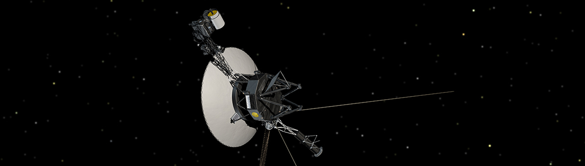

# Solving the mystery of the missing symbols!

> [!NOTE]
> This is the conclusion to the story I [wrote about](./2025-03-16-duckdb-mingw-inline-fn.md) earlier.

In our earlier investigation we identified the issue was introduced by
the commit
[d1ea1538](https://github.com/duckdb/duckdb/commit/d1ea1538c9217fb536485f1500f04a0b55b1e584).
However we could not ascertain the underlying reason for the problem.
To take this further, I tried to isolate which part of the change was
the cause.

## A dead-end

With the objective of identifying the source file responsible for the
bug, I started by inspecting the different build artifacts, and
checking for the C-API symbols.  But first, I needed to log all the
build commands.  Unfortunately it is much easier to do this with Make
than Ninja (default generator for DuckDB).  We can choose our
generator by calling CMake as:

```bash
cmake -G "Unix Makefiles" ...
```

We can then log all the build commands by starting a verbose build
with Make:

```bash
VERBOSE=1 make -j6 |& tee build.log
```

With all the build commands recorded to a log file, I searched for
commands that create the shared library `libduckdb.dll`.  I narrowed
it down to the following set of build commands:

```bash
/usr/bin/cmake -E rm -f CMakeFiles/duckdb.dir/objects.a
/usr/bin/x86_64-w64-mingw32-ar qc CMakeFiles/duckdb.dir/objects.a @CMakeFiles/duckdb.dir/objects1.rsp
/usr/lib64/ccache/x86_64-w64-mingw32-g++ -O3 -DNDEBUG -O3 -DNDEBUG   -shared -o libduckdb.dll \
    -Wl,--out-implib,libduckdb.dll.a -Wl,--major-image-version,0,--minor-image-version,0 -Wl,--whole-archive \
    CMakeFiles/duckdb.dir/objects.a -Wl,--no-whole-archive @CMakeFiles/duckdb.dir/linkLibs.rsp
```

Going through the steps individually, we see that eventhough the
symbols are present in the earlier steps, the final library creation
step drops them.

> [!TIP]
> While not helpful on its own, this observation will make sense later.

```bash
# find the C-API object file
$ tr ' ' '\n' <CMakeFiles/duckdb.dir/objects1.rsp | grep capi.cpp
main/capi/CMakeFiles/duckdb_main_capi.dir/ub_duckdb_main_capi.cpp.obj
# check for symbols
$ nm -C main/capi/CMakeFiles/duckdb_main_capi.dir/ub_duckdb_main_capi.cpp.obj | grep duckdb_vector_size
0000000000004f60 T duckdb_vector_size
# check for the C-API object file in the objects archive
$ /usr/bin/x86_64-w64-mingw32-ar t CMakeFiles/duckdb.dir/objects.a | grep capi.cpp
ub_duckdb_main_capi.cpp.obj
# check for C-API symbols in the objects archive
$ nm -C CMakeFiles/duckdb.dir/objects.a | grep duckdb_vector_size
0000000000004f60 T duckdb_vector_size
# check if the C-API symbols are public
$ winedump -j export CMakeFiles/duckdb.dir/objects.a | grep duckdb_vector_size
 31a0ae4 duckdb_vector_size
# create the shared library
$ /usr/lib64/ccache/x86_64-w64-mingw32-g++ -O3 -DNDEBUG -O3 -DNDEBUG   -shared -o libduckdb.dll \
    -Wl,--out-implib,libduckdb.dll.a -Wl,--major-image-version,0,--minor-image-version,0 -Wl,--whole-archive \
    CMakeFiles/duckdb.dir/objects.a -Wl,--no-whole-archive @CMakeFiles/duckdb.dir/linkLibs.rsp
# the C-API symbols exist
$ nm -C libduckdb.dll | grep duckdb_vector_size
00000001f3d116e0 T duckdb_vector_size
# but they are not exported
$ winedump -j export libduckdb.dll | grep duckdb_vector_size # no match
```

## A clue

Since the problem source file could not be identified, next I went on
bisecting the contents of the problem commit.  Since the problem was
with the C-API symbols, I started with the related files:

- `src/include/duckdb.h`,
- `src/main/capi/aggregate_function-c.cpp`, and
- `test/api/capi/capi_aggregate_functions.cpp`.

I commented out parts of the above files, while ensuring the build
still succeeds, and checking for the C-API symbols in the final DLL in
the usual way.  This led me to discover that the problem disappears if
we reorder the include headers in
`src/main/capi/aggregate_function-c.cpp`.  You can see the change in
this PR:
[duckdb/duckdb#16396](https://github.com/duckdb/duckdb/pull/16396/files).

```diff
diff --git a/src/main/capi/aggregate_function-c.cpp b/src/main/capi/aggregate_function-c.cpp
index 43ddfdbc074a..1379f652d669 100644
--- a/src/main/capi/aggregate_function-c.cpp
+++ b/src/main/capi/aggregate_function-c.cpp
@@ -1,9 +1,11 @@
+// clang-format off
+#include "duckdb/main/capi/capi_internal.hpp"
+// clang-format on
 #include "duckdb/catalog/catalog.hpp"
 #include "duckdb/common/type_visitor.hpp"
 #include "duckdb/common/types.hpp"
 #include "duckdb/function/function.hpp"
 #include "duckdb/function/scalar_function.hpp"
-#include "duckdb/main/capi/capi_internal.hpp"
 #include "duckdb/main/client_context.hpp"
 #include "duckdb/parser/parsed_data/create_aggregate_function_info.hpp"
 #include "duckdb/planner/expression/bound_function_expression.hpp"
```

This is of course not a correct solution, since there should not be
any dependence on the order in which we include headers.  It is
indicative of an underlying bug.  This means some definition in the
headers is being overridden.  This can only happen for preprocessor
macros, anything else would trigger a compilation error.

## Mystery solved!

After further investigation from DuckDB core developer Mark, the issue
was resolved in this PR:
[duckdb/duckdb#13697](https://github.com/duckdb/duckdb/pull/16397).
So what was the issue?

When building shared libraries for Windows, the public API has to be
marked for export.  This done by [adding the
attribute](./2025-02-15-duckdb-julia-windows.md#symbol-visibility-in-windows-dlls)
`__declspec(dllexport)` to the relevant symbols.  In the DuckDB
codebase this is done by defining a macro `DUCKDB_API` that expands to
that attribute.  However there were two such definitions, they were in:

- `src/include/duckdb.h`, and
- `src/include/duckdb/common/winapi.hpp`.

Superficially they seem equivalent, however they are actually used in
slightly different contexts.  The macro defined in `duckdb.h` is used
to annotate symbols that are part of the *C-API*.  The macro defined
in `winapi.hpp` however is used to mark symbols part of the *C++ API*.
In an earlier commit
([367595af](https://github.com/duckdb/duckdb/commit/367595af51b459d07121647bc2de1beabc836e0c)),
the macro defined in `winapi.hpp` was changed to exclude MingW.

```diff
diff --git a/src/include/duckdb/common/winapi.hpp b/src/include/duckdb/common/winapi.hpp
index 2cff5d12d4..65dd89975e 100644
--- a/src/include/duckdb/common/winapi.hpp
+++ b/src/include/duckdb/common/winapi.hpp
@@ -9,7 +9,7 @@
 #pragma once
 
 #ifndef DUCKDB_API
-#ifdef _WIN32
+#if defined(_WIN32) && !defined(__MINGW32__)
 #if defined(DUCKDB_BUILD_LIBRARY) && !defined(DUCKDB_BUILD_LOADABLE_EXTENSION)
 #define DUCKDB_API __declspec(dllexport)
 #else
```

When exporting symbols, MingW excludes inline functions.  This macro
redefinition excludes symbol export for MingW.  Depending on which
definition is seen first, symbols may not be exported.

- If `DUCKDB_API` in `duckdb.h` is seen first, symbols are exported correctly, and
- if `DUCKDB_API` in `winapi.hpp` is seen first, some symbols are not exported.

The fix was to rename one of the macros to make the two definitions
distinct so that they do not interfere with each other; i.e.

- `DUCKDB_API` in `duckdb.h` was renamed to `DUCKDB_C_API`, and
- `DUCKDB_API` in `winapi.hpp` remains unchanged.

## What did we learn?

1. Bisection is an incredibly effective idea that can be used in many
   different contexts.
2. Macro hygiene is important.


*Image Credit: [NASA/JPL-Caltech](https://science.nasa.gov/image-detail/pia17049-hires/)*
